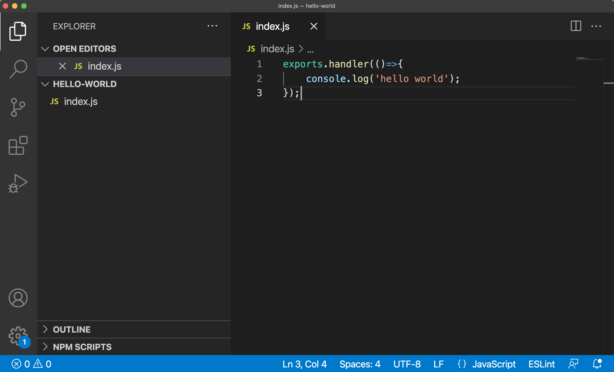

# Hello world (JS)

### Index.js

First let's create a simple hello-world script. We are creating a function called handler() that we act as the entryPoint of our Function. Our goal is to print a simple "hello world" to the console.

```javascript
exports.handler(()=>{
    console.log('hello world');
});
```

If you are using visual studio code, this should look something like this:



### Deploying with the ExH CLI

You can deploy it to the task service using the EXH CLI Tool.

```
exh tasks sync --name hello-world \
   --code= my/directory \
   --entryPoint=index.handler \
   --runtime="nodejs14.x"
```

To create a function we need to provide:

* Function name (`name`)
* Reference to the directory containing the (built) code (`code`)
* The entryPoint in this case our handler function in the index.js file (`entryPoint`)
* The runtime needed to run our code (`runtime`)


You can see a hello-world function has been created in the task service. Visit the [Task service documentation](https://app.gitbook.com/o/-MkCjSW-Ht0-VBM7yuP9/s/-Mi5veV04lYlkS769Dcp/) on how to create a task and run it.

### Tips

* When synchronizing your task, make sure that you also include the `node_modules` directory if necessary
* Make sure not include any developer dependencies when bundling your task. Otherwise the size of your task might be too big (there is a 10MB limit). You can easily strip developer dependencies by using `npm install --production` or `yarn install --production`
