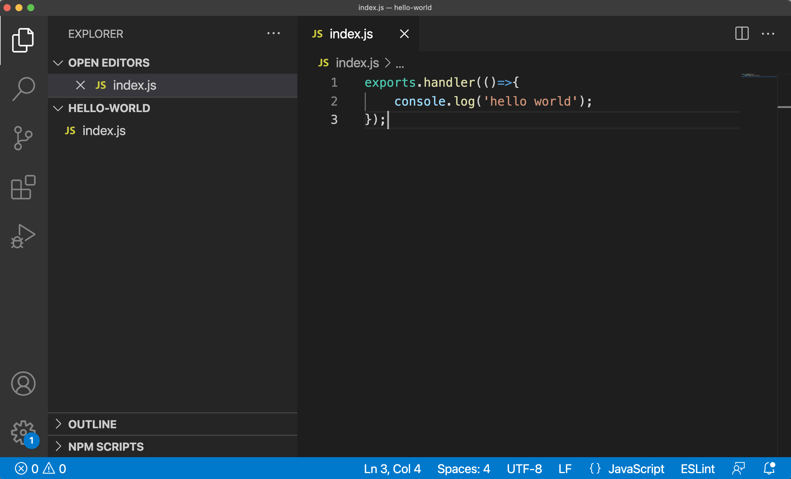

# Tasks

## List tasks

```
exh tasks functions list
```

This command will list all functions currently configured in the task service.

## Create a new function

You can create a new function by uploading your packaged code to the task service.

```
exh tasks functions create <functionName> <options>
```

### NodeJs example

First let's create a simple hello-world script.

```javascript
exports.handler(()=>{
    console.log('hello world');
});
```

this should look something like this.



Next we can package our script in a zip file. This will put our **index.js** file in the root of code.zip. You can also include dependencies by including the node\_modules folder in your zip file.

```
zip code.zip index.js
```


## Update a function

```
exh tasks functions update <functionName> <options>
```

## Delete function

```
exh tasks functions delete <functionName>
```
