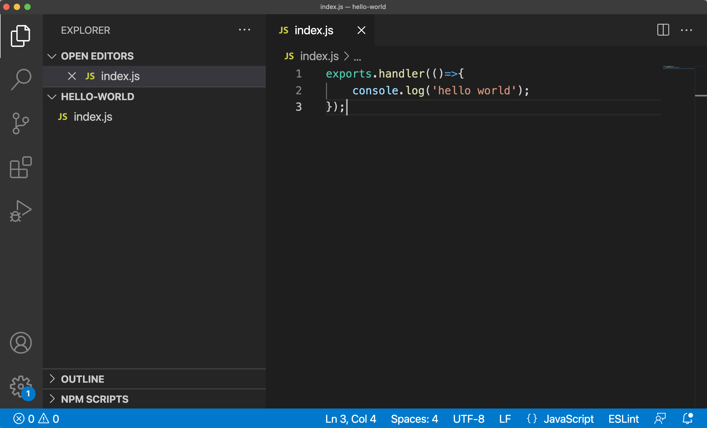

# Hello world Task

### Index.js

First let's create a simple hello-world script. We are creating a function called handler() that we act as the entryPoint of our Function. Our goal is to print a simple "hello world" to the console.

```javascript
exports.handler(()=>{
    console.log('hello world');
});
```

If you are using visual studio code, this should look something like this:



### Creating a packaged zip file

To upload our hello world script as a function to the task service we will need to put in in a zip file. We can use the **zip** in command line tool to create our zip file.

```
zip code.zip index.js
```

This will put our **index.js** file in the root of code.zip. You can also include dependencies by including the node\_modules folder in your zip file. This should look like this.


### Deploying with the ExH CLI

Once our script is packaged in a zip file we can deploy it to the task service using the EXH CLI Tool.&#x20;

```
exh tasks functions create hello-world \
   --code=code.zip \
   --entryPoint=index.handler \
   --runtime="nodejs12.x"
```

To create a function we need to provide:

* Function name;
* Reference to the zip file;
* The entryPoint in this case our handler function in the index.js file and;
* The runtime needed to run our code.


You can see a hello-world function has been created in the task service. Visit the [Task service documentation](https://app.gitbook.com/o/-MkCjSW-Ht0-VBM7yuP9/s/-Mi5veV04lYlkS769Dcp/) on how to create a task and run it.
